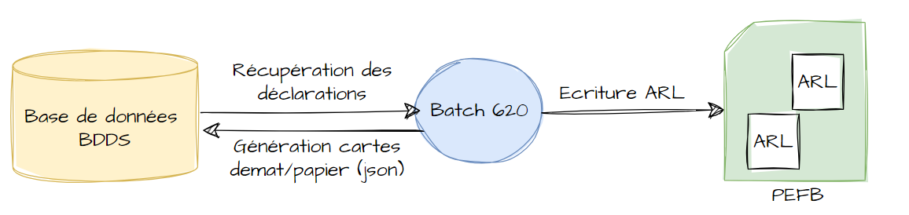

### Description

L'OMU 620 permet de générer les cartes dématérialisées et les cartes papiers en fonction des services activés sur les AMC.

Il se base sur les déclarations intégrées depuis le dernier lancement de l’OMU (ou sur la date de synchronisation si elle est définie sur l’AMC)

### Schéma des interactions

### Evènements publiés

Les événements suivants sont envoyés : 

- Insurance.serviceeligibility.declaration.conso.event lors de la consolidation d'une carte
- Insurance.serviceeligibility.declaration.conso.failed.event en cas d'échec de la consolidation des déclarations dans le but de générer une carte TP
- Insurance.serviceeligibility.carteTP.demat.creation.event lors d’une création d'une carte TP dématérialisée
- Insurance.serviceeligibility.carteTP.demat.desactivation.event lors de la désactivation d’une carte dématérialisée existante
- Insurance.serviceeligibility.carteTP.papier.generate.event lors de la génération d’une carte papier
- Insurance.serviceeligibility.carteTP.papier.generate.failed.event en cas d'échec de la génération d’une carte papier
- Insurance.serviceeligibility.carteTP.demat.active.event qui donne le nombre de cartes dématérialisées actives en fin de traitement