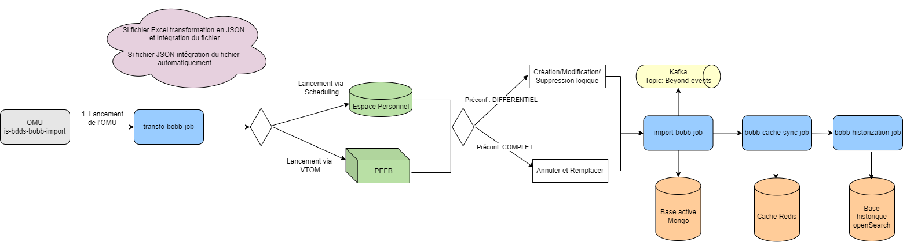

# BOBB - Import des fichiers de correspondance

## Description :

L'OMU “BOBBImport” consiste à importer des fichiers de correspondance produit BO/Beyond.

## Schéma des intéractions :

Ci-dessous un schéma de synthèse repéresentant les échanges et intéractions de ce traitement:

Cette OMU bobb-import-omu (is-bdds-bobb-import) est déclenché manuellment par l'utilisateur ou dans le plan d'exploitation:
- Dans le plan d'exploitation l'OMU est toujours lancé en mode différentiel(ajout/modification/suppression logique), il peut importer plusieurs fichiers par ordre de dépôt, les fichiers BOBB sont récupérés de la PEFB.
- Le mode complet(annule et remplace) est réservé au lancement via l'UI Scheduling par un utilisateur, un seul fichier importé par excécution, il est  récupéré de l'espace personnel de l'utilisateur.  
- L'OMU peut importer des fichiers sous format .json et .csv

### Les valeurs des paramétres en entrée :
- Indicateur de forçage : Valeurs possibles "OUI/NON" 
- Mode d'import : Valeurs possibles "COMPLET/DIFFERENTIEL"

### Les données à récupérer des variables d’environnement
- Pourcentatge de volumétrie : Valeur par défaut "95%"

### Eléments du CREX :
- Indicateur de forçage
- Pourcentage de volumétrie
- Mode d'import
- Nombre et noms des fichiers en entrés
- Nombre et noms des fichiers importés(OK & KO)

### La liste des évènements envoyée:
- bobb-import-file-succeeded-event.schema.json
- bobb-import-file-failed-event.schema.json
- bobb-import-line-succeeded-event.schema.json
- bobb-import-line-failed-event.schema.json
