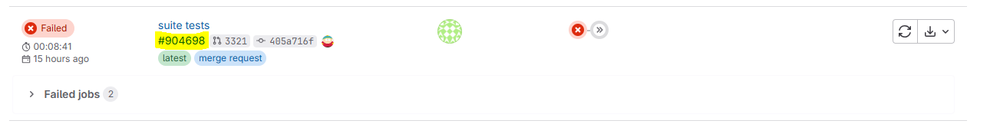

Comment migrer les tests de services en java :

- Prendre un fichier .feature
    - les méthodes qui ne sont plus connues en cucumber js ont déjà été migrés en java.
- Le déplacer dans le répertoire serviceeligibility\tests\src\serviceTest\resources\feature
- migrer les étapes qui n'ont pas été migrés
- déplacer les fichiers de ressources dans les répertoires request et response
    - Si possible mettre les fichiers dans le dossier au nom de la collection mongo auquel il correspond. Avec une
      sous dossier au nom de la jira ou directement dans le nom du json.
- changer les endpoints de test en java
    - Les endpoints de test ne doivent plus exister. Il faut traduire les méthodes utilisées dans une classe service
      directement dans le project de test. Ex: createContractTest dans TestConsumerContractService qui avant était
      l'endpoint /v6/declarants/{idDeclarant}/testContracts.
- supprimer les endpoints de test (si plus utilisé)
- Pour lancer les tests il faut déployer un env de test et ajouter en TARGET_ENV l'env de test
- Les tests à lancer sont à paramétrer via @IncludeTags(...)
- Puis cliquer sur la flèche de lancement dans la classe TestPocApp.java, ce qui va créer un profil de lancement des
  tests qui pourra être ensuite relancer
- **TOBECONTINUE**

**Voir si on peut pointer directement sur le dossier de features
serviceeligibility\tests\serviceeligibility-core-api\features pour gérer plsu facilement les modification venant de la
pi15**

# Lancer les tests de service

## EO : configuration INTELLIF
A ne faire qu'une seule fois
Pour lancer un test lors de l'initialisation du projet, il faut créer la tache gradle :
1. dans le panel gradle : cliquer sur les trois points pour ouvrir le menu déroulant
2. dans la section "configuration", cliquer sur EDIT...
3. dans la fenêtre nouvellement ouverte 'run/debug configuration' : indiquer
4. name = "serviceTests"
5. Run = "local machine" dans la liste déroulante
6. dan la section suivante RUN svc-test-main:serviceTest --tests "com.cegedim.next.serviceeligibility.core.cucumber.ServiceTests"
   [img.png](img.png)
5. cliquer sur "OK"

## E1 : dans gitlab
Faire la merge request depuis GitLab
Faire un premier commit push pour créer et lancer une première pipeline

## E2 : dans intellij OU Autre éditeur
Dans le fichier serviceeligibility\tests\src\serviceTest\resources\application.yaml, remplacer le :
> TARGET_ENV: t-XXXXXX

par le numéro de pipeline dans gitlab :

exemple : numéro de pipeline #893554 donne 
> TARGET_ENV: t-893554

Dans le fichier ServiceTests.java (chemin tests/src/serviceTest/java/com.cegedim.next.)
le @IncludeTags("xxxxx") indique quel est le tag (les tags ?) à utiliser pour appeler tous les tests qui doivent être lancés.
On peut trouver notamment
- @smokeTests pour tous
- @nosmokeTests : ancien tag
- @batch620
- @itelis

Exemple : si @IncludeTags("marie"), ajoutez le tag @marie au dessus des tests gherkins que l'on souhaite lancer

Fichier .feature :
> @smokeTests @pauv5 @marie
> Scenario: Get pau TP_OFFLINE without nirCode but with subscriberId
> ....

Fichier \tests\src\serviceTest\java\com\cegedim\next\serviceeligibility\core\cucumber\ServiceTests.java
> @ExcludeTags("disabled")
> @IncludeTags("marie")
> .....

Dossier /request pour les fichiers json entrants dans le chemin tests/src/serviceTest/resources/eligibility
Dossier /response pour les expected outcome json dans le chemin tests/src/serviceTest/resources/eligibility

## E3 : dans la section GRADLE d'INTELLIJ
Cliquer sur le bouton "RUN" pour lancer tous les tests
Cliquer sur le bouton "DEBUG" pour lancer tous les tests et s'arreter sur les breakpoints paramétrés.

NB : pour ajouter un breakpoint : cliquer sur le numéro de ligne en question, un point rouge devrait s'afficher.